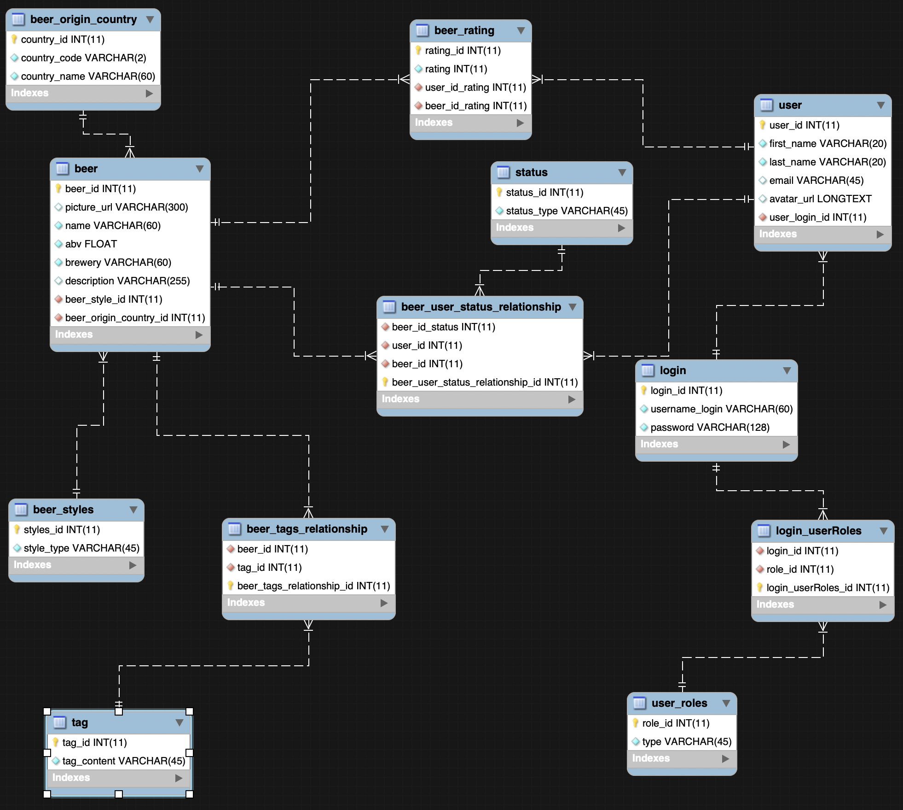
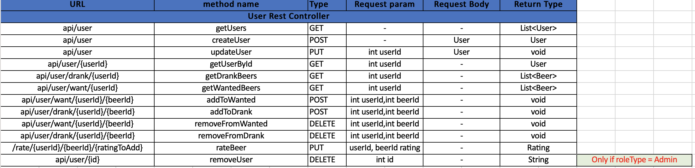
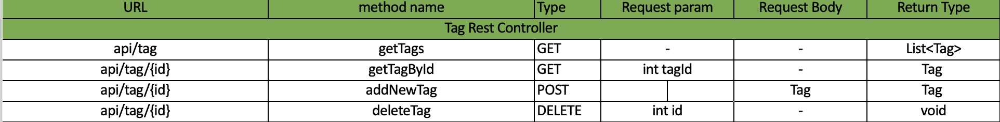
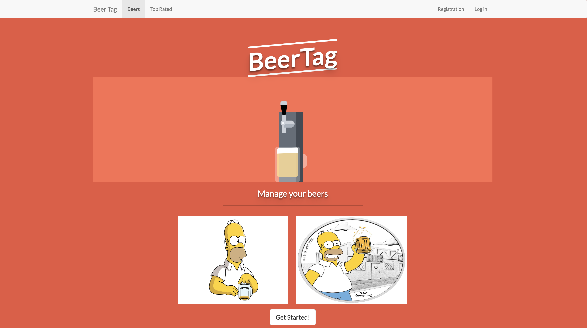
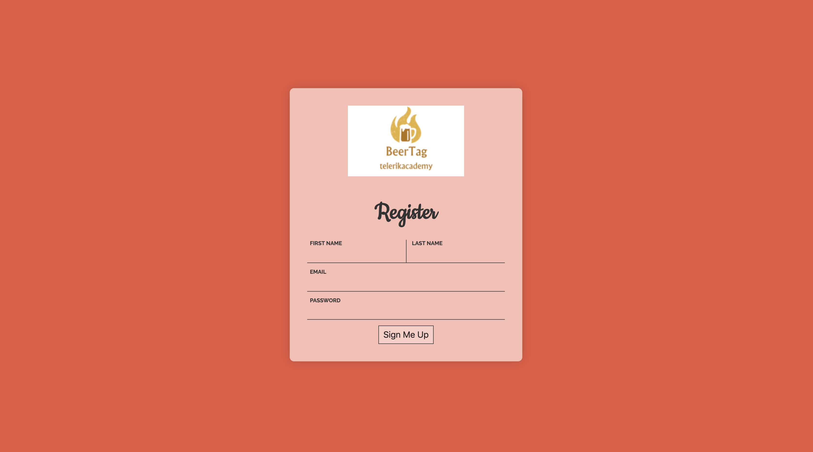
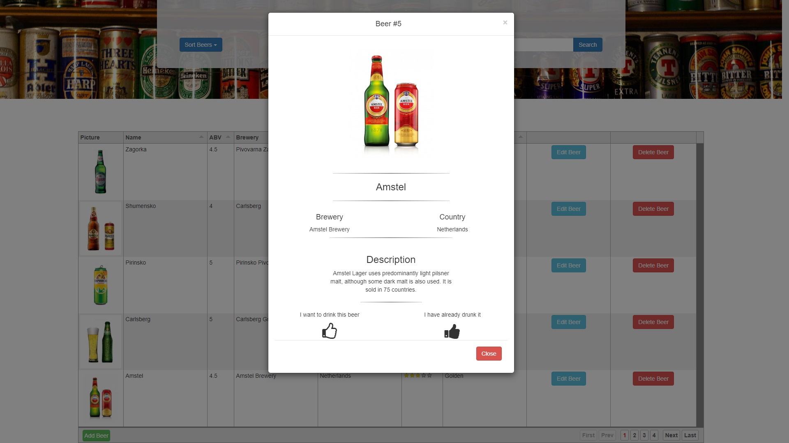

# BeerTag 
## Team Project Assignment

BeerTag enables your users to manage all the beers that they have drank and want to drink. Each beer has detailed information about it from the ABV (alcohol by volume) to the style and description. Data is community driven and every beer lover can add new beers and edit missing information on already existing ones. Also, BeerTag allows you to rate a beer and calculates average rating from different users.

## Database Diagram

## REST API documentation

### Beers

### Users

### Tags

## Photos

                .
                .
                .
                
## Technologies
### Back-end
- Java 
- Spirng Boot
- Maria DB
- Hibernate

### Front-end
- jQuery
- Bootstrap
- HTML 5
- CSS 3
- thymeleaf